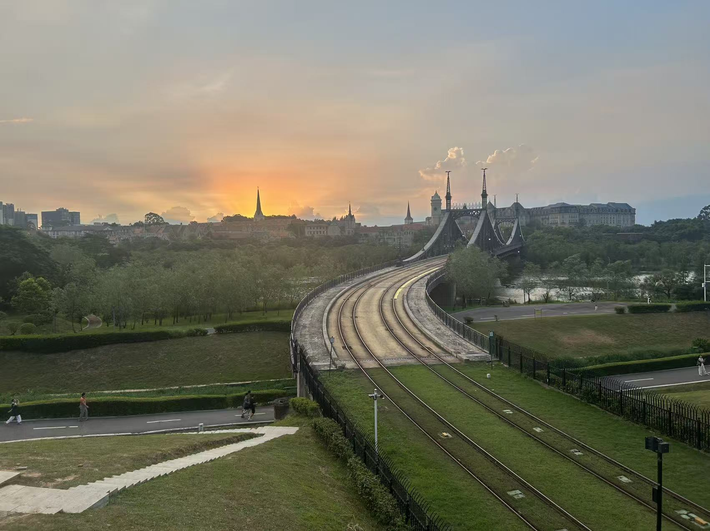

<iframe frameborder="no" border="0" marginwidth="0" marginheight="0" width=330 height=86 src="//music.163.com/outchain/player?type=2&id=1974444806&auto=1&height=66"></iframe>

2023年4月，来到东莞工作，这是我第一次踏入社会，并不是真心实意，也可以说是不情不愿。总之，就是来到了这里，怀着失意、悲伤。

在这里，做着测试的工作，也不知道什么是测试，只是网上都说是“点点点”，也就说每天对着电脑点点网页、点点手机。

刚上班的时候，领导很严厉，领导说每天要测够40个用例，领导说经过了一年的训练，直到离职的那一天我也没有做到。我出现了一种幻觉，我以为我上了研究生，我想我上了研究生的朋友是不是也是这样？我没有求证。

在公司里面需要进行一些考试，只记得那一天，准备科目一的时候，我在公司坐了一个下午，感觉写的测试用例的代码都是正确的，为什么样例只过了2个、3个，我不得理解，就在那里写了2~3个小时，样例还是只过了两三个，最后我只能重新下载了题目的代码，发现原来是交的代码的题目错了，我重新提交了一次，才过了十几个样例。这一天活得很挫败，回家的路上我边走边想，我都已经上班了，怎么还不如我的学生时代，怎么什么都做不成。

在来到这里之前，我给朋友说2024年我要再考一次研究生，我现在需要歇息一年，我不能再考了。刚开始的时候，我还会刷点leetcode的题目，到后面突然想通了一件事情，就算我今天不学习，我明天还是会有工作，所以我就开始放弃自己，现在想想应该是学习善待自己。

其实，在这里过的蛮快乐的，当时我觉得自己活不下去了，我看公众号推文有说，人在6个月之后，生活会重新建立，所以不用担心什么。也果真如此，除了上班时间，大部分时间都过得很快乐，我买了自己喜欢的自行车，骑着它去了深圳，后来我才发现，我到达的地方是深圳的角落的角落，可以说是只要我少蹬上两脚，我就还在东莞。我还探索了附近所有的麻辣烫，这里的饭实在找不到有什么好吃的，只有麻辣烫成为了我的最爱。

最后，我从这里离职了，离职离得优柔寡断，现在回想，确实不是一件好事情，给领导造成了很多不必要的麻烦。

之后，就要上学了，我知道还有很多失败等待着我，我认为自己已经有了与之匹配的能力去解决他们。

