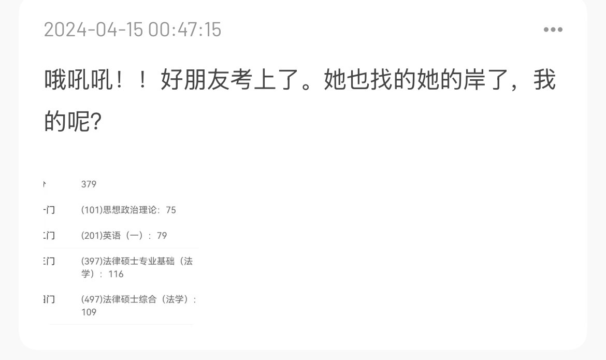

> 很久很久之前，第一次开通微信公众号的时候，就给好朋友说，第一篇推文就写余周周，现在终于有点想法写出来了。

前段时间，看到新认识的朋友的公众号发的奔奔的故事，我的大脑快速飞转，毫不费力的就搜索到了我喜欢的小说女主——余周周。

余周周，是我从高三开始喜欢的小说女主角，现在已经存在我的生活也十年之久了。

这本书的名字是叫《你好旧时光》。现在我还清楚的记得我高中的时候学习非常不好，虽然也有在努力，但是考试成绩对于我来说却犹如抱薪救火，于事无补。这部电视剧最触动我的是一个叫主角游戏的对话。我在高三的时候，也幻想自己是主角，自己也可以成为天下第一。

```text
“周周，我们玩个游戏吧。”
“嗯？”
“我们来玩主角的游戏。”
“主角的游戏？”
“就是那种主角被很多人嘲笑，瞧不起，陷害，然后突然掉下山崖，所有人都不知道他是生是死，他去了哪里。
可是山崖下面总是有洞穴，洞穴里面总是有秘籍。等他重出江湖，大家都发现他已经成了天下第一，无人能敌……”
他好像被自己的说法窘到了，所以笑起来，“就是这种游戏。”
```

其实这个对话说的是《倚天屠龙记》的张无忌，我在上班的时候，趁着午休时间，看完了《倚天屠龙记》。

高考成绩出来之后，不尽如人意，在村里走路都绕着人走，生怕谁的唾沫变成了钉子。当然，我也成为了家里最让人担心的人，我妈怕我想不开。

从23年开始，我开始心情不好的时候就给周周留言，是在网易云音乐的一首纯音乐《我是余周周》。

其实比留言更早的行为是在本科的时候，每个学期末会有一个德育答辩大会，印象中记得只开过一次，当时做了ppt，我把主角游戏这段话放进了PPT里面，这是我第一次展示我喜欢的事物。

再之后就是好好努力学习，每天不停的学习新的编码技术，也期待着在这个山崖下面找到秘籍，然后就天下第一，无人能敌了。

第一次考研的时候，我就开始听这首纯音乐了，当时看着别人也会像周周倾诉，考试、生活、科研，都会在网易云音乐的评论里面告诉周周。那时我只是看着，并没有想要留言的冲动。不过我有看到别人的留言，觉得挺好的，会改到我的微信的个人签名上，比如“我们依旧在翻过每一座小山丘呢！”，“我是余周周的粉丝”，还有“🐟🥣🥣”之类的。

我的第一次留言是考研二战没考上，我躺在家里，感觉当时的我被抽空了力气，至今我还自己自己颓废的样子，虽然不似电视剧里胡子拉碴，但是是真的没有起床的力气，当时的我也很气人，现在还记得把我妈气的在我旁边哭。由于对于未来的迷茫，我看着身边的朋友的生活都在顺利进行，而我像是被拉起了暂停键，不知道未来该去往何方。我在出成绩的当天，留下了我的第一句话。


后面就是去找工作了，找工作实在不是一件易事。投100份简历能有一个人回复已经算是苍天有眼了。偶然的情况下，我点到了一份外包的工作。也是这份偶然，让我可以有了进入社会的机会，同时也一点一点地压碎了我对未来人生的期望。尽管我开始了工作，我依然想不出自己未来要做什么，我知道我是不喜欢这份工作的，我知道我需要生存。我在进入工作前的那几天，我住在学长的租的房子里，我给我的学长说，我第二年一定会去考研的。

就这样，我去工作了。当时的思维总觉得自己的本科学校太差了，一定要读个研究生才能找到一个好工作，或者说是觉得去读研对于一个普通的本科生才是成功。对，这就是我的评价标准，工作的时候，我依然会关注考研，关注那一年的考研的一些消息，并且看完。我有认识边工作边考研的一个同事，我也尝试过，我发现我做不到。因为如果我要工作的话，我就必须对工作负责。如果我投入考研的话，我就干不好工作了。在这两种情况下，我选择了干好工作，顺便让自己休息休息（就是什么都不做）。

在我工作的第二年，和我熟悉的好朋友都考上研究生了，我在向他们表达祝福的时候，又想了想我的未来到底在何方，我该通往哪一座岸呢。


我又找出来之前关注的考研的经验帖读了又读，并把他们贴到自己的日记里面。我害怕考不上，所以在朋友考上到7月份的时候，我一直在犹豫要不要辞掉工作，期间我问了很多很多的人，读研究生到底是怎么样的，他们的回答都是“痛苦”（现在“痛苦”我体会到了，这个我们以后再说。）到7月底，我终于下定决心，辞掉了工作。我打包了我的所有东西，离开了东莞，我人生第一次漂泊的地方。

后面，我就开始考研了，我知道自己最不擅长的就是考试了，整个考研过程准备的很烂很烂。我害怕自己考不上，其实是每夜每夜的睡不着，我看网上说，晚上听书可以催眠，于是我就把《你好，旧时光》这本书找出来，重新听了一遍，就当作给自己加油打气了。我又一次向余周周求救，我在《你好，余周周》这首音乐里又留下了我的烦恼。


时光就那样推进着，推进着，到了考试，我感觉自己每一场都答的很好，至少下考场很开心。

一如即往，万事胜意。